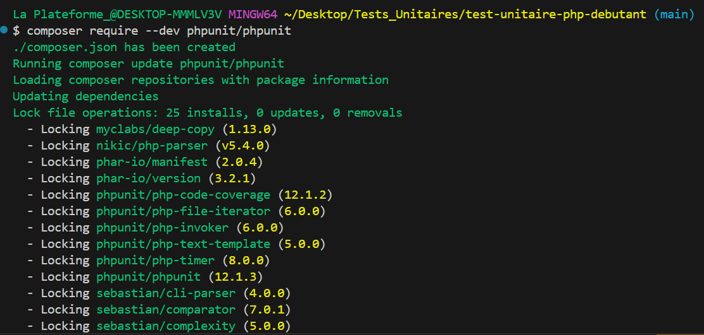
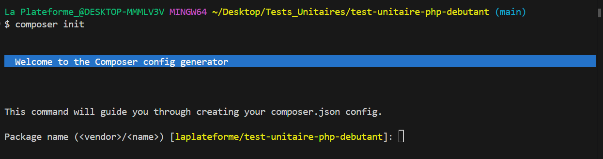
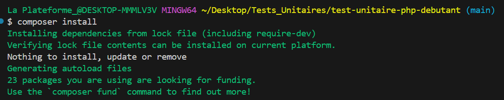
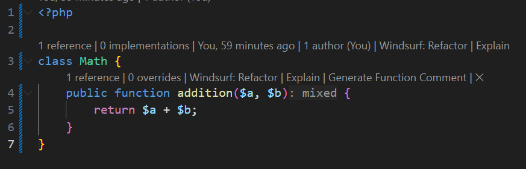
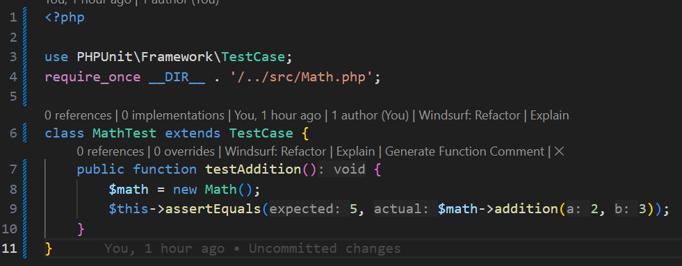
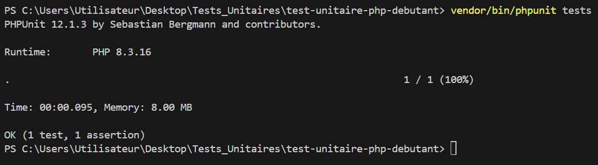
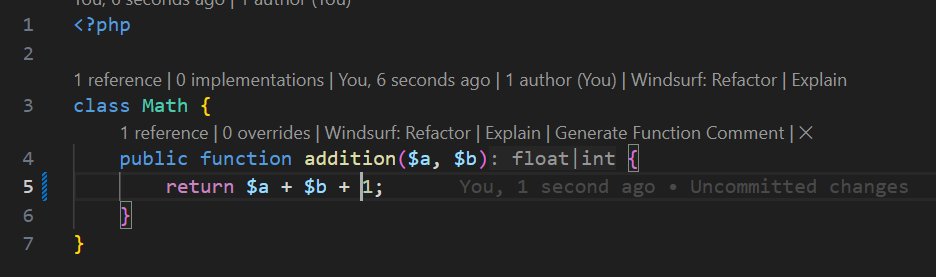
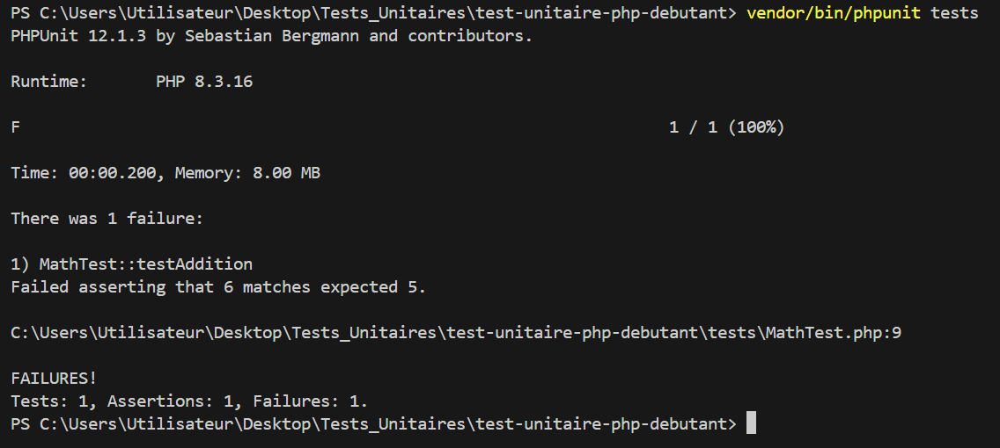

# test-unitaire-php-debutant
Job02 Jour 02 Apprentissage des Tests Unitaires dans le Code.

Préparation du dossier TEST-UNITAIRE-PHP-DEBUTANT
Création du dossier Pictures (où seront stockées les copies-écran illustrant le README)

Installation du composer.json et composer.lock à partir du Bash, dans le Terminal (Rappel : ces fichiers permettront à ???????????????) : 

composer require --dev phpunit/phpunit    [pour installer les 2 fichiers composer]

composer init   [pour choisir des dépenses à installer, si nécessaire, donc qui ne seraient pas incluses dans le composer.lock]

composer install (pour installer les dépenses sélectionnées)

Dans le fichier Math.php, création de la classe Math avec la fonction addition.

Dans le fichier MathTest.php, création du Test Unitaire pour vérifier l'exactitude de ma fonction : 

Lancement du test PHPUNIT pour vérifier l'exactitude du calcul : 

vendor/bin/phpunit tests

Le test est passé avec succès : 

Le test échoue (j'ai rajouté un 1 dans mon calcul) : 

